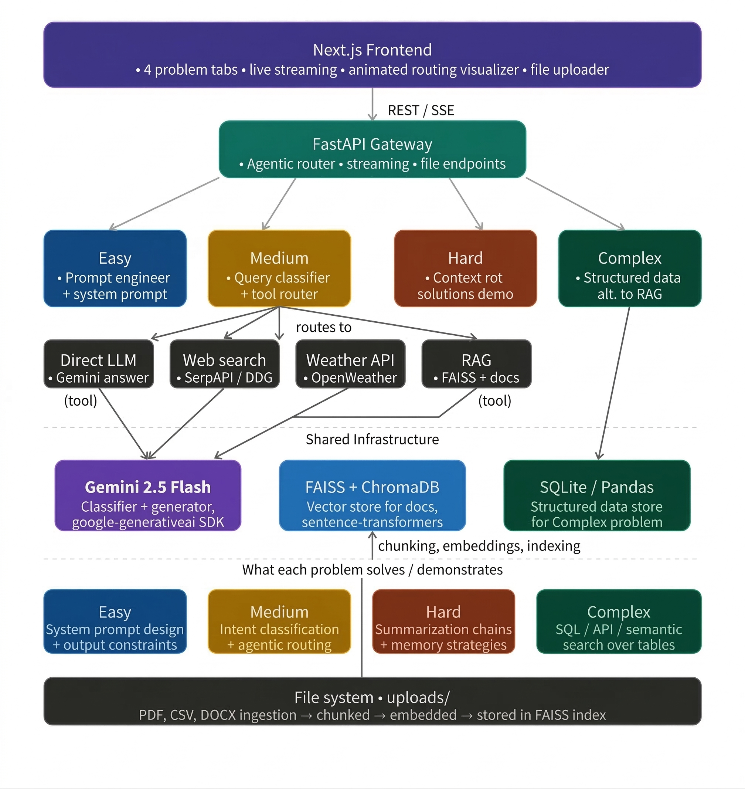

# GenAI Workshop — Problem Solving Round

A full-stack agentic AI application demonstrating solutions to all 4 workshop problems using **Gemini 2.5 Flash**, **FastAPI**, and **Next.js**.
**Easy:** A side-by-side prompt engineering demo that runs the same query through a raw (no system prompt, temp 0.9) and an engineered (structured system prompt, temp 0.3) setup simultaneously — making the quality difference immediately visible.
**Medium:** A LangGraph-powered agentic router with a typed AgentState that flows through a compiled state graph: a classifier node uses Gemini to detect intent (DIRECT / WEB_SEARCH / WEATHER / RAG), a conditional edge routes to the appropriate tool node, and a final answer node formats the response. The routing decision is streamed live to the UI.
**Hard:** An interactive context compression lab with three selectable strategies — sliding window (keep last N words), summarization chain (chunk → compress → meta-summarize via Gemini), and hierarchical memory (Gemini extracts episodic, semantic, and archival layers as structured JSON) — with compression ratio stats and optional follow-up Q&A on the compressed context.
**Complex:** A text-to-SQL pipeline where Gemini generates a SQLite query from natural language, executes it on an uploaded CSV/Excel dataset, and returns both the results table and a natural language answer — alongside a Gemini-generated explanation of exactly why RAG would fail on the same question.
The RAG component uses ChromaDB (persistent vector store with cosine similarity) for document ingestion across PDF, DOCX, and TXT formats.

---

## Architecture



```
frontend/   → Next.js 16 (TypeScript, Tailwind, Framer Motion)
backend/    → FastAPI (Python 3.13)
  routers/
    easy.py           → Prompt engineering demo
    medium.py         → Agentic 4-tool router
    hard.py           → Context rot strategies
    complex_router.py → Text-to-SQL + structured data
  services/
    gemini.py         → Gemini 2.5 Flash wrapper
    rag_service.py    → ChromaDB
```

---

## Problem Solutions

| Problem | Difficulty | Approach |
|---------|-----------|----------|
| Inconsistent chatbot responses | Easy | Engineered system prompt with format/tone/length rules |
| Student assistant routing | Medium | Gemini intent classifier → 4 tools (LLM, Web, Weather, RAG) |
| Context rot in long conversations | Hard | Sliding window, summarization chain, hierarchical memory |
| RAG vs structured data | Complex | Text-to-SQL via Gemini → SQLite execution |

---

## Quick Start

### 1. API Keys

```bash
cp backend/.env.example backend/.env
# Edit .env and add your keys:
# GEMINI_API_KEY=your_key      (required)
# TAVILY_API_KEY=your_key      (required)
```

Get Gemini API key free at: https://aistudio.google.com/

### 2. Backend

```bash
cd backend
python -m venv venv
source venv/bin/activate        # Windows: venv\Scripts\activate
pip install -r requirements.txt
uvicorn main:app --reload --port 8000
```

### 3. Frontend

```bash
cd frontend
npm install
npm run dev
# Open http://localhost:3000
```

---

## API Endpoints

### Easy — Prompt Engineering
```
POST /api/easy/generate
{ "query": "...", "mode": "raw" | "engineered" }
→ SSE stream of text chunks
```

### Medium — Agentic Router
```
POST /api/medium/query
{ "query": "..." }
→ SSE stream: first { type: "routing", intent, reason }, then { type: "text", text }

POST /api/medium/upload-doc
form-data: file (PDF/TXT/DOCX)
→ { status, filename, chunks }
```

### Hard — Context Strategies
```
POST /api/hard/analyze
{ "text": "...", "strategy": "sliding_window|summarization_chain|hierarchical_memory",
  "window_size": 150, "query": "..." }
→ { meta, answer, context_preview }
```

### Complex — Text-to-SQL
```
POST /api/complex/upload
form-data: file (CSV/XLSX/JSON)
→ { rows, columns, schema, sample }

POST /api/complex/query
{ "question": "..." }
→ { sql, results, nl_answer, rag_comparison }
```


## Tech Stack

- **LLM**: Google Gemini 2.5 Flash (`google-generativeai`)
- **Vector Search**: ChromaDB + `sentence-transformers` (all-MiniLM-L6-v2)
- **Structured Queries**: SQLite via pandas + Gemini text-to-SQL
- **Backend**: FastAPI with async streaming (SSE)
- **Frontend**: Next.js 16, Tailwind CSS, Framer Motion
